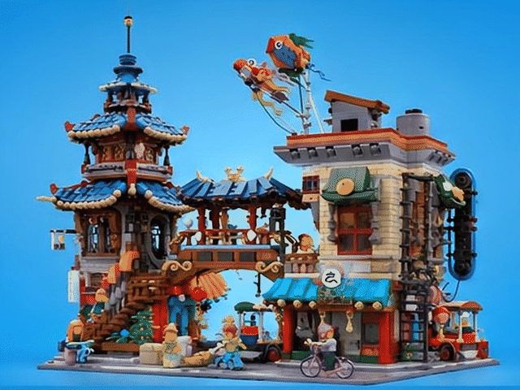

# 产品动图生成器

> 你给我产品照片，我还你一段会自动循环播放的产品动图。

这个技能是给"不会用设计软件、但需要动图素材"的人用的。
你不需要懂任何技术，只要会发图片、会说话就够了。

---

## 一、它能做什么

- 一张商品图 → 镜头缓缓绕着产品转动的动图
- 一张场景图（房间、街道、建筑、模型）→ 有空间纵深感的环绕动图
- 一次性画出 16 个连续画面，首尾自动接上，可以**无限循环播放**
- 一份素材同时给你三种格式：
  - **GIF** —— 微信、详情页、老平台通用
  - **WebP** —— 网页、现代平台，更清晰更小
  - **MP4** —— 广告投放、短视频素材

**它不会做什么：** 多个角色互动、有剧情的长动画、复杂的电影运镜。
这类需求硬做会"崩画面"，不是它的强项。

---

## 二、怎么用（就三步）

直接在你的agent(codex/workbuddy等)安装好本skill,命令：
 product-motion-gif skill生成 gif,参考图2个 ： d1.webp，d2.webp 

 
| 步骤 | 你要做的 | 我会做的 |
|---|---|---|
| 1 | 把产品图发过来，说一句"做成环绕动图" | 出图、切帧 |
| 2 | 看第一张"分镜检查表" | 把 16 个画面编号排开给你逐格看 |
| 3 | 任意的要求AI优化和修改  | 任意的要求修改和参考图 |

**重要：效果好不好，只有你说了算。**
我自己的判断不作数，所以每一步做完我都会立刻把成品交给你看，绝不自己替你拍板。
你说不对，我就改；改到你说"就是这个感觉"为止。

---

## 三、几条"默认规矩"（都是你亲自点头定下来的）

| 规矩 | 为什么 |
|---|---|
| **默认只转 60°** | 从正脸慢慢转到四分之三侧脸就停。绝不转到背面——那是"转圈圈"，不是"产品展示"。 |
| **开头慢、后面快** | 观众有时间看清第一眼的画面，之后自然提速，像广告片收尾。 |
| **首尾无缝** | 播完自动倒放回来，循环看多少遍都看不出接缝。 |
| **不做"画面稳像"** | 试过一种让画面更稳的处理，结果反而更抖，所以默认关掉。产品环绕时本来就该有横向位移，那是真实视差，不该抹平。 |
| **不要追求 4K** | 曾经花过 2.5 倍的钱点"4K"，实测跟 2K 肉眼没有任何差别——它是把 2K 放大交差的。这笔钱不花了。 |
| **文件控制在 3MB 内** | 太大微信发不动。但清晰度优先，宁可稍微大一点，也不要交一张糊的。 |

---

## 四、什么样的图效果最好

**最理想：**
- 背景干净——纯色底、白底、蓝底影棚都很好
- 画面里只有一个主体
- 轮廓清楚，主体完整不出画面
- 方形或 4:3 的图最合适

**效果会打折：**
- 背景杂乱、堆了很多东西
- 主体跑到画面边缘甚至出画
- 长条形的截图

---

## 五、两个"画质档位"（省钱的关键）

| 档位 | 什么时候用 | 花费 |
|---|---|---|
| **试水档** | 试说法、试角度、试构图——所有不确定的尝试都用它 | 便宜，约为定稿档的一半 |
| **定稿档** | 效果已经确认，出最终交付版 | 约贵一倍 |

所以正确流程是：**先用便宜的把效果试到你满意，最后才用贵的那一档正式出片。**
不要一上来就用定稿档试错。

---

## 六、常见问题

**问：只能给一张图吗？**
答：可以给两三张。比如"产品外观图 + 内部结构图"。
但一定要说明每张是干什么用的——否则它会自作主张把内部结构也画进画面里。

**问：为什么是 16 格？**
答：这是效果和成本的甜点。格数再多，画面开始漂移、钱还翻倍；少了又不够流畅。

**问：成品能有多大？**
答：一般 640 像素宽左右。纹理特别密的图（比如樱花树、砖墙）会自动缩到 500 多像素，好塞进 3MB。
想要更大只能换一种网格排法，代价是格数变少、流畅度下降。

**问：这跟直接用 AI 生成视频有什么区别？**
答：AI 视频是一格一格各画各的，越画越不像，产品会慢慢变形。
这套方法是"一次性画好 16 个画面"，所以前后一致性好，产品不会走样。

**问：一次要等多久？**
答：主要时间在画那 16 个画面上。所以"试水档"不只是省钱，也是省时间。

---

## 七、如果效果不理想

按这个顺序排查，通常能对上号：

1. **画面里出现了不该有的东西** → 参考图的角色没说清楚，重新说明每张图是"外观"还是"参考"
2. **产品越转越变形** → 图里主体太多或背景太乱，换一张干净背景的图
3. **看着抖** → 先确认是哪一步引入的：是画出来就抖，还是合成时抖
4. **细节糊了 / 文件太大** → 这是同一个预算的两头，只能选一个优先

拿不准就直接把图发过来，我看一眼就知道问题在哪。

---

## 八、它背后的原理（一句话版）

> 不是"生成一段视频"，而是**一次性画好 16 张连续的画面**，再按节奏把它们连起来播放。

好处是每一张都由同一个"脑子"、同一次作画完成，所以产品形状、颜色、光位前后一致，
不会像逐帧生成那样越飘越远。

## 特别致谢

https://linux.do 社区支持
