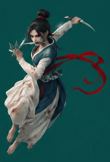
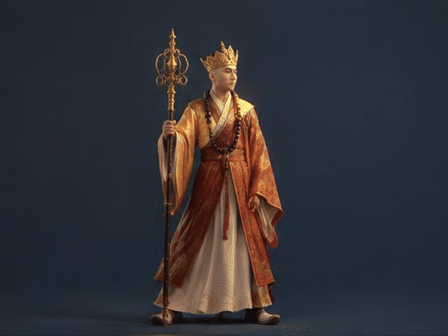
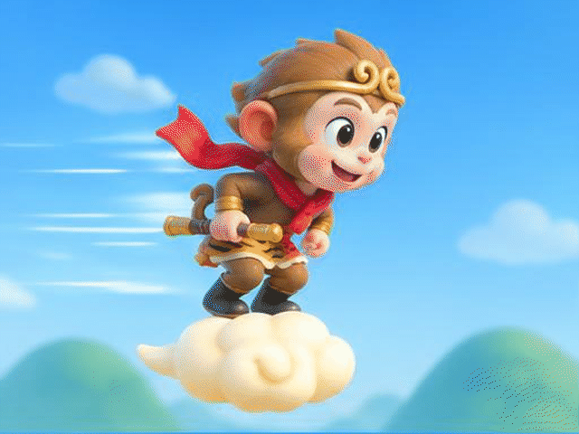
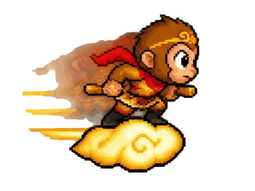
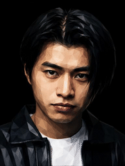

# GIF定格动画产品动图生成器

> 你给我产品照片，我还你一段会自动循环播放的产品动图。利用GPT-Image 2.5 一次性生成多格帧图 - 合成为动画gif - 一次调用就生成动态图

这个技能是给"不会用设计软件、但需要动图素材"的人用的。
你不需要懂任何技术，只要会发图片、会说话就够了。

---

## 一、它能做什么

**核心只有一件事：** 一次性画出 16 个连续画面，首尾接上，让你无限循环播放。
同一份素材同时给你三种格式——**GIF**（微信、详情页通用）、**WebP**（更清晰更小）、
**MP4**（广告投放用）。

至于"画面里到底在动什么"，分五类。你可以直接翻到第二节看动图效果：

| 类别 | 画面里在动的是 | 要不要给图 | 典型用途 |
|---|---|---|---|
| **A 环绕展示**（默认） | 镜头绕着主体转，背景横移 | **要给**（产品图/插画/场景图） | 电商主图、详情页、产品展示 |
| **B 角色动作** | 主体自己打一套招式，背景不动 | **可以不给**，说一句就画 | 游戏人物放技能、角色动作 |
| **C 速度型动作** | 主体做动作 + 背景向后掠（速度感） | **可以不给** | 飞行、奔跑、冲刺 |
| **C2 像素风 / 透明底** | 同 C，但换成街机像素风、背景透明 | **可以不给** | 游戏素材、可叠加到任意场景 |
| **D 表情包** | 一张脸的表情连续变化，其余全不动 | **要给**（人像/人脸图） | 聊天表情包、情绪演出 |

**还能叠加的小效果：** A 类可以一边转一边推近（越看越大）；也可以让画面里**一个小角色**
顺带动一下（比如镜头环绕时，山上的猴子沿山脊走几步）。

**它不会做什么：** 多个角色互相打斗互动、有剧情的长动画、复杂的电影运镜。
这类需求硬做会"崩画面"，不是它的强项。

---

## 二、案例集：五类效果长什么样

> 下面每一张都是**真实跑出来的成品**，直接看着挑。
> 对应的动图文件都在本技能的 `cases/` 文件夹里，可以双击打开慢慢看。

### A. 环绕展示（默认效果）

*一张纯色底的人物插画，做成"从左绕到右 60°"的循环动图。*

- **你会提供：** 一张产品图 / 插画 / 场景图
- **你可以这么说：** "把这张图做成环绕动图"（不说别的，默认就是这个）
- **默认动作：** 镜头从左往右扫 60°（起点偏左 30°、中间回到原图角度、终点偏右 30°），
  开头慢、后面快，播完自动倒放回来
- **适合：** 电商主图、详情页首图、模型/摆件/单品的立体展示

### B. 角色动作（不用给图，从零画）

*"唐僧用锡杖聚气、挥出金光"——纯文字描述生成，没有给任何参考图。*

- **你会提供：** 什么都不用给，一句话描述角色和招式
- **你可以这么说：** "生成一个唐僧挥锡杖发出金色气功波的动图，国风 3D 游戏渲染，深色纯色底"
- **画面特点：** 镜头**完全不动**，背景锁死，动作全在角色身上
- **适合：** 游戏角色放技能、招式演示、人物登场动作

### C. 速度型动作（背景向后掠）

*"孙行者翻着筋斗云飞速前进"——任天堂 3D 卡通风格，天空与山丘在向后掠。*

- **你会提供：** 一句话描述角色、风格、速度感
- **你可以这么说：** "生成孙行者踩着筋斗云飞速往前翻筋斗的动图，任天堂那种 3D 卡通风格"
- **画面特点：** 镜头不动、角色也不横穿画面，**速度感全靠背景向后掠**
- **适合：** 飞行、奔跑、冲刺这类"正在快速移动"的动作

### C2. 像素风 + 透明底（游戏素材）

*街机像素风 + 透明底 + 夸张动效（背景是透明的，这里直接看会随你的界面底色变化）。*

同一套素材还有两个版本：

| 版本 | 文件 | 尺寸 | 用途 |
|---|---|---|---|
| 高清原生 | `cases/C2-arcade-transparent.gif` | 512×384 | 保持像素锐利，做游戏素材用这个 |
| 街机颗粒 | `cases/C2-arcade-pixel128.gif` | 128×96 | 颗粒最粗、最有老街机味 |
| **WebP 版** | `cases/C2-arcade-transparent.webp` | 512×384 | **透明素材优先用这个**，比 GIF 干净 |

- **你可以这么说：** "换街机像素风、透明背景、动作再夸张一点"
- **一个客观事实要知道：** GIF 只支持"全透明 / 全不透明"，**没有半透明**。
  所以源图里用半透明画的"残影"，合成 GIF 时会被压成**实心色块**。
  想要干净的残影，得在生成时就要求"残影用实心像素来画"。这一条已经写进技能的规则里。
- **透明素材请优先用 WebP**：它支持真正的半透明，同分辨率下比 GIF 干净得多。

### D. 表情包（一张脸演一整套表情）

*给一张人脸，做"中性 → 挑眉坏笑 → 瞪眼震惊 → 咧嘴大笑 → 收回中性"的循环表情包。*

- **你会提供：** 一张人像 / 人脸图（**这一类的脸就是"身份"，必须给图**）
- **你可以这么说：** "用这张脸做个表情包，要那种很夸张的表情，像周星驰那样"
- **画面特点：** 机位锁得最死（只到肩膀），背景完全不动，**只有脸上的表情在变**
- **适合：** 聊天表情包、情绪演出、角色头像动效

---

## 三、怎么用（就三步）

需要 GPT-Image 2.5 ，推荐注册得到api: https://apiz.ai/ ,
直接在你的agent(codex/workbuddy等)安装好本skill,命令：
 product-motion-gif skill生成 gif,参考图2个 ： d1.webp，d2.webp 

| 步骤 | 你要做的 | 我会做的 |
|---|---|---|
| 1 | 把图发过来（A、D 类必须给图；B、C 类不用给），说一句要什么效果 | 出图、切帧 |
| 2 | 看那张"分镜检查表" | 把 16 个画面编号排开给你逐格看 |
| 3 | 任意的要求AI优化和修改  | 任意的要求修改和参考图 |

**重要：效果好不好，只有你说了算。**
我自己的判断不作数，那些"质检数据"也只是参考——它测的只是**整幅轮廓**，而有些图
（宽扁的风景、铺满画面的插画、纯色底上的单个主角）它根本测不准，甚至**会报反**：
实测同一张素材，"没转起来的那版"被判成"有变化"、"真正转起来的那版"被判成"只是平移"。
所以每一步做完我都会立刻把成品交给你看，绝不自己替你拍板，也不拿这些数字替代你的判断：
**你看了说行，才算行。** 你说不对，我就改；改到你说"就是这个感觉"为止。

---

## 四、几条"默认规矩"（都是你亲自点头定下来的）

| 规矩 | 为什么 |
|---|---|
| **环绕默认只转 60°，而且是"从左往右"扫** | 起点偏左、中间回到原图角度、终点偏右，等于从左绕到右走一段 60° 的弧。对比过"只往一个方向转 60°"，**这个方向读起来明显更好认**，所以定为默认。绝不转到背面——那是"转圈圈"，不是"产品展示"。|
| **先说清楚"绕的是谁"** | 一张图里可能有好几样东西。不点明主角，镜头就不知道该围着哪一样转，结果往往变成"原地轻微晃动"而不是环绕。 |
| **产品始终在画面中间，是背景在移动** | 镜头一直对着产品绕，所以产品自己在画面里的位置基本不动，**"转"是靠背后的景物横向滑过体现的**。这是你定的规矩，比让产品在画面里乱跑读起来更稳。 |
| **"背景动不动"要看是哪一类** | 环绕类**必须动**（那是转动的唯一线索）；角色动作类**必须完全不动**；速度型动作**必须向后掠**。抄错就会毁效果。 |
| **开头慢、后面快** | 观众有时间看清第一眼的画面，之后自然提速，像广告片收尾。 |
| **首尾无缝** | 播完自动倒放回来（环绕类），或者第 16 格收回到第 1 格的姿势（动作类），循环看多少遍都看不出接缝。 |
| **不做"画面稳像"** | 试过一种让画面更稳的处理，结果反而更抖，所以默认关掉。环绕时本来就该有横向位移，那是真实视差，不该抹平。 |
| **默认用 2K，不点 4K** | 4K 是把 2K 放大交差的，多花 2.5 倍的钱。**除非你要的成品比 500 像素还大**——那时候 2K 的像素不够用了，才必须上 4K（比如给你 800 像素宽的大图）。所以：默认省钱，你说"要更清晰"我才点。 |
| **文件控制在 3MB 内** | 太大微信发不动。但清晰度优先，宁可稍微大一点，也不要交一张糊的。 |
| **看素材选格式** | 背景是干净纯色的（白底、影棚底），GIF 就够用；画面铺满整张图的插画/照片、以及**透明底**素材，改用 WebP——同样清晰度只有 GIF 的三分之一大小，而且透明素材只有 WebP 是干净的。 |

---

## 五、什么样的图效果最好

**最理想：**
- 背景干净——纯色底、白底、蓝底影棚都很好
- 画面里只有一个主体
- 轮廓清楚，主体完整不出画面
- 方形或 4:3 的图最合适

**也很好用（值得单独说）：**
- **纯色底上只有一个主角、哪怕人物占满整幅**（比如一张全身插画）。这类图一致性照样很好，
  唯一要花心思的是"怎么让人一眼看出在转"——因为背景是一片纯色、没东西可滑动，
  转动只能靠主角自己的轮廓变化。所以要把"哪几个地方会变"说清楚（见下面排查第 3 条）。
- **不给图的角色动作/表情包**：一致性同样可靠，因为 16 个画面是同一次画出来的。

**效果会打折：**
- 背景杂乱、堆了很多东西
- 一套图里有好几个主体/角色
- 长条形的截图

---

## 六、两个"画质档位"（省钱的关键）

| 档位 | 什么时候用 | 花费 |
|---|---|---|
| **试水档** | 试说法、试角度、试风格——所有不确定的尝试都用它 | 便宜，约为定稿档的一半 |
| **定稿档** | 效果已经确认，出最终交付版 | 约贵一倍 |

所以正确流程是：**先用便宜的把效果试到你满意，最后才用贵的那一档正式出片。**
不要一上来就用定稿档试错。

---

## 七、常见问题

**问：只能给一张图吗？**
答：可以给两三张。比如"产品外观图 + 内部结构图"。
但一定要说明每张是干什么用的——否则它会自作主张把内部结构也画进画面里。

**问：为什么是 16 格？**
答：这是效果和成本的甜点。格数再多，画面开始漂移、钱还翻倍；少了又不够流畅。

**问：成品能有多大？**
答：默认 500～640 像素宽。纹理特别密的图（比如樱花树、砖墙）会自动缩到 500 多像素，好塞进 3MB。
**想要 800 像素左右的大图，说一句"要更清晰"就行**——那时候得换一档更贵的画法，像素才够用。
再大就只能换一种网格排法，代价是格数变少、流畅度下降。

**问：能让画面里的东西动一下吗？**
答：可以，看是哪一类：
- **让整幅画面里的一个小角色动**（比如山上的猴子走两步）——要明确告诉我是哪个、怎么动
  （走路 / 转头 / 拍翅膀）、动多远，其余一切锁死。一次让好几个东西动，画面就会开始崩。
- **让主体自己打一套招式**——B / C 类，直接描述角色和动作就行，不用给图。

**问：能给透明背景吗？**
答：可以，但透明素材**优先用 WebP**。原因是 GIF 只支持"全透明/全不透明"，
半透明的柔边、残影、光晕会被切成硬邦邦的色块；WebP 支持真正的半透明。
这一点在 C2 案例里有具体说明。

**问：这跟直接用 AI 生成视频有什么区别？**
答：AI 视频是一格一格各画各的，越画越不像，产品会慢慢变形。
这套方法是"一次性画好 16 个画面"，所以前后一致性好，产品不会走样。

**问：一次要等多久？**
答：主要时间在画那 16 个画面上。所以"试水档"不只是省钱，也是省时间。

---

## 八、如果效果不理想

按这个顺序排查，通常能对上号：

1. **画面里出现了不该有的东西** → 参考图的角色没说清楚，重新说明每张图是"外观"还是"参考"
2. **产品越转越变形** → 图里主体太多或背景太乱，换一张干净背景的图
3. **看着没在转，只是在轻轻晃** → 两个常见原因：
   一是**没点明主角是谁**，镜头不知道该围着哪样东西绕；
   二是**背景是整片纯色、什么特征都没有**（比如纯青底、纯黑底），没东西可以横向滑过，
   这时"转"只能靠**产品自己的轮廓变化**来体现——必须点明"哪几个地方会变"
   （哪一侧身体转向镜头、带子甩到了哪边、衣角/侧缝落在哪），说得越具体越好。
4. **小角色没动** → 说明它没被当成"唯一要动的东西"，得再强调一次"只让它动、别的全锁死"
5. **角色动起来后脸/身体在抖** → 那是"机位被锁得不够死"，得再强调一次"镜头完全不动"
6. **看着抖** → 先确认是哪一步引入的：是画出来就抖，还是合成时抖
7. **细节糊了 / 文件太大** → 这是同一个预算的两头，只能选一个优先；
   真要又大又清，就得换贵的那一档
8. **透明底边上出现脏色块 / 残影变成实心块** → GIF 不支持半透明造成的，改用 WebP 版
9. **想要更清晰** → 直接说一声，我换更大的画法重出一版（会多花一些额度，所以我会先问你）

拿不准就直接把图发过来，我看一眼就知道问题在哪。

---

## 九、它背后的原理（一句话版）

> 不是"生成一段视频"，而是**一次性画好 16 张连续的画面**，再按节奏把它们连起来播放。

好处是每一张都由同一个"脑子"、同一次作画完成，所以产品形状、颜色、光位前后一致，
不会像逐帧生成那样越飘越远。

---

## 附：案例文件清单

上面第二节用到的动图，都在本技能的 `cases/` 目录下：

| 文件 | 对应类别 | 尺寸 | 说明 |
|---|---|---|---|
| `cases/A-orbit-60-l2r.gif` | A 环绕展示 | 218×320 / 30 帧 | 纯色底插画，左→右 60° 环绕（默认效果） |
| `cases/B-character-action.gif` | B 角色动作 | 640×480 / 16 帧 | 唐僧锡杖聚气挥出金光，无参考图生成 |
| `cases/C-scroll-flight.gif` | C 速度型动作 | 640×480 / 16 帧 | 孙行者翻筋斗云，背景后掠 |
| `cases/C2-arcade-transparent.gif` | C2 像素透明 | 512×384 / 16 帧 | 街机像素风、背景透明 |
| `cases/C2-arcade-pixel128.gif` | C2 像素透明 | 128×96 / 16 帧 | 同上，老街机颗粒版 |
| `cases/C2-arcade-transparent.webp` | C2 像素透明 | 512×384 / 16 帧 | 同上，**透明素材推荐用这个** |
| `cases/D-expression-loop.gif` | D 表情包 | 180×240 / 16 帧 | 一张脸演完整套夸张表情 |

想看技术细节（提示语怎么填、参数怎么选、踩过哪些坑），看同目录的 `SKILL.md`。

## 特别致谢

https://linux.do 社区支持
